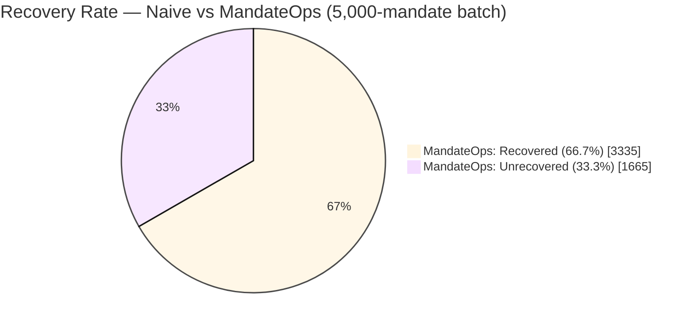
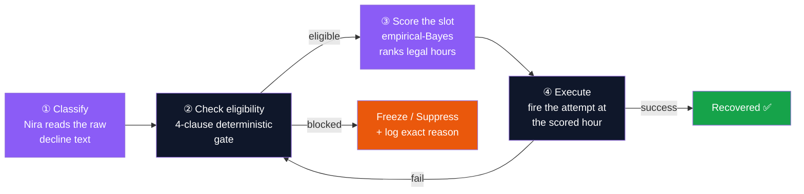
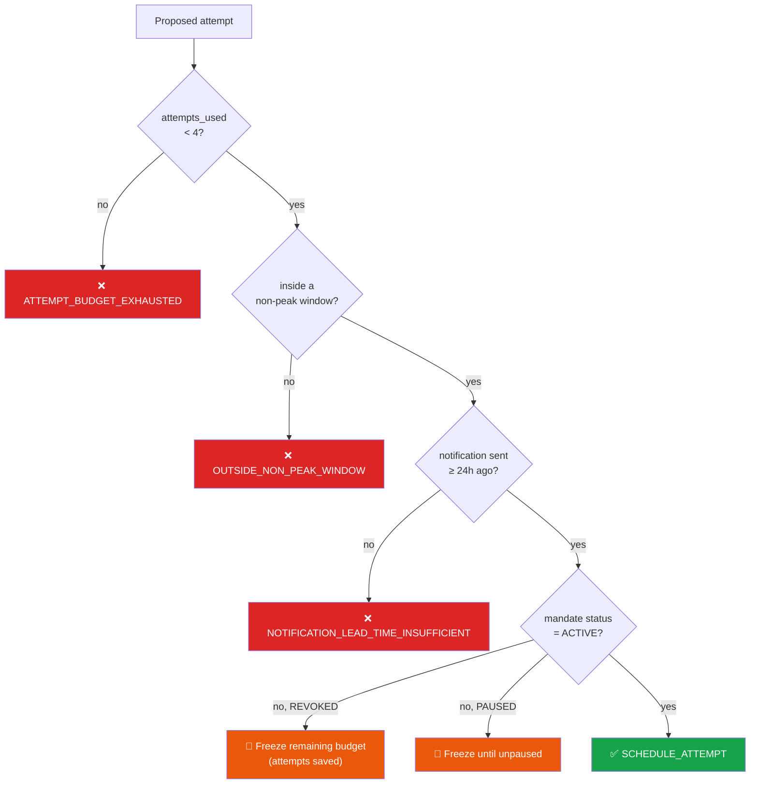
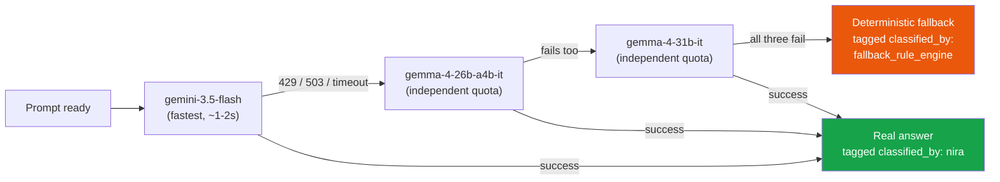
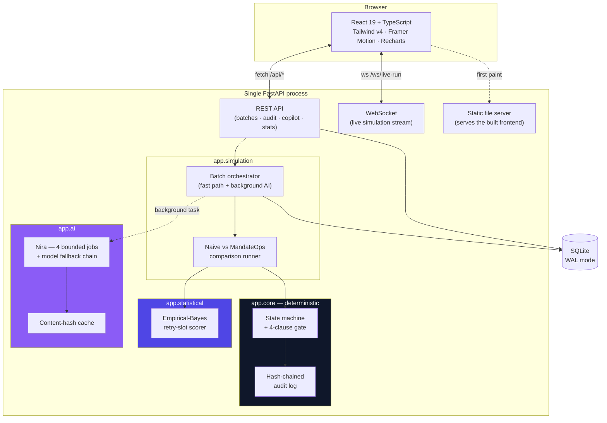
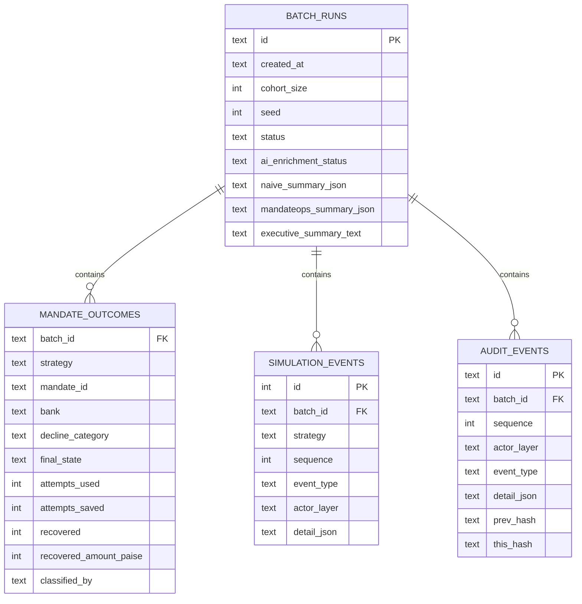
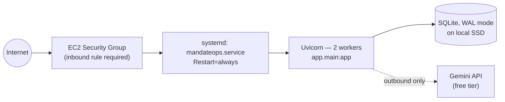

<div align="center">

# MandateOps

### A constraint-aware UPI AutoPay retry sequencer

**Razorpay Buildathon 2026 — Track 03: AI Revenue Recovery**

NPCI gives every failed mandate exactly **one initial attempt plus three retries** — no fifth chance, ever — inside fixed legal hours, with a mandatory 24-hour customer notice. MandateOps treats every retry as a scarce, budgeted resource instead of a blind cron job, and uses AI only where AI actually belongs: reading messy text, never moving money.

[](#testing)
[](#tech-stack)
[](#tech-stack)
[](#tech-stack)
[](#tech-stack)
[](#license)

### 🔗 [**Live demo — http://100.56.247.98:8080**](http://100.56.247.98:8080)

Deployed on an AWS EC2 instance (2 vCPU / 4GB RAM), served by FastAPI + Gunicorn behind systemd, running the real Gemini-backed AI layer. No login required — click **Run Batch** on the dashboard.

</div>

---

## Table of contents

- [The problem](#the-problem)
- [The result, measured](#the-result-measured)
- [How it works](#how-it-works)
- [The rulebook — deterministic core](#the-rulebook--deterministic-core)
- [The scorer — statistical layer & the math](#the-scorer--statistical-layer--the-math)
- [Nira — the AI layer](#nira--the-ai-layer)
- [System architecture](#system-architecture)
- [Data model](#data-model)
- [API reference](#api-reference)
- [Tech stack](#tech-stack)
- [Project structure](#project-structure)
- [Local development](#local-development)
- [Testing](#testing)
- [Deployment](#deployment)
- [Design system](#design-system)
- [Known limitations, stated honestly](#known-limitations-stated-honestly)
- [Credits & sources](#credits--sources)

---

## The problem

UPI AutoPay — India's fastest-growing recurring-payment rail — is quietly leaking revenue at a scale most subscription businesses have never measured.

| Metric | Value | Source |
|---|---|---|
| AutoPay approval rate, Jan 2024 → Nov 2025 | **50% → 30%** (even as volume grew 10×) | Moneycontrol |
| NPCI attempt ceiling per billing cycle | **1 initial + 3 retries = 4, hard stop** | Economic Times / ETBFSI |
| RBI minimum pre-debit notice | **24 hours**, before any attempt | RBI e-mandate framework |
| Subsequent debits failing (balance / bank downtime / dead mandate) | **20 – 90%**, cohort-dependent | Razorpay / Livemint |

This isn't customers leaving. It's **involuntary churn** — the subscriber wanted to pay, a debit failed for a mechanical reason, and nobody scheduled the retry correctly. Every rupee of it is recoverable margin with **zero acquisition cost**.

The reason nobody has fixed this well: NPCI doesn't give you unlimited chances. Retry blindly, in the wrong hour, against a mandate the customer already killed, and you don't just fail — you burn one of only four chances you will ever get.

## The result, measured

Not a projection. This is the output of `run_naive()` vs `run_mandateops()` over the **same synthetic 5,000-mandate cohort**, same seed, same ground-truth outcome model — reproducible from the Live Simulation page or a single script run.

```
NAIVE (next-day retry, ignores every rule)        MANDATEOPS (constraint-aware)
────────────────────────────────────────          ─────────────────────────────
Recovered:        2,483 / 5,000  (49.66%)         Recovered:        3,335 / 5,000  (66.70%)
Recovered ₹:      ₹14,85,717                       Recovered ₹:      ₹20,03,665
Attempts used:    17,023                           Attempts used:    13,196
Attempts saved:   0                                Attempts saved:   2,219
```

<div align="center">

| | Naive Retry | MandateOps | Δ |
|---|:---:|:---:|:---:|
| **Recovery rate** | 49.66% | **66.70%** | **+17.04 pp** |
| **Rupees recovered** | ₹14,85,717 | **₹20,03,665** | **+₹5,17,948** |
| **Attempts wasted on dead mandates** | 17,023 spent, 0 saved | 13,196 spent, **2,219 saved** | **13% fewer attempts spent, more recovered** |

</div>



The delta comes from exactly two mechanisms, both cheap to verify by reading the code:

1. **Scarce-attempt discipline.** A mandate revoked or paused mid-cycle stops burning attempts the instant the rail-side status changes — instead of a naive engine spending 2–3 more guaranteed failures on it.
2. **Slot selection.** Among the legal hours NPCI actually permits, MandateOps fires into the hour with the highest historical success probability for that (bank × decline-reason) pair, instead of "whatever hour next-day happens to be."

## How it works

Every failed mandate goes through the same fixed, four-step pipeline. No step is skipped, no step is reordered.



The single most important design decision in this system: **money never moves because a model said so.**

| Layer | Made by | Why |
|---|---|---|
| Whether a mandate is retried | **Deterministic state machine** | Legally and financially consequential — must be 100% reproducible |
| Which time slot to use | **Statistical scorer** (empirical Bayes) | Inspectable math, not a black box, reports its own confidence |
| What a messy bank decline string means | **Nira (Gemini)** | Free text has no fixed schema — exactly what LLMs are good at |
| What to say to the customer | **Nira**, from approved templates only | Tone/language variation, zero financial authority |
| Answering a human's question about a batch | **Nira**, grounded in that run's data only | Judgment lives in retrieval-then-explain, not decision-making |
| What happens if every AI model is down | **Deterministic fallback, tagged transparently** | AI availability must never be a single point of failure for money movement |

---

## The rulebook — deterministic core

Three independently-sourced rules, composed into one four-clause eligibility gate. This is the file ([`app/core/rules.py`](backend/app/core/rules.py)) a judge who knows payments should be able to read top to bottom and verify by hand — no AI, no randomness, no hidden state.

### Rule 1 — the attempt budget

```
MAX_ATTEMPTS_PER_CYCLE = 4      # 1 initial attempt + 3 retries. Hard ceiling.
```

Source: NPCI's August 2025 UPI rule changes (Economic Times / ETBFSI coverage). Once spent, a cycle is `EXHAUSTED` — full stop, independent of anything else.

### Rule 2 — non-peak execution windows

NPCI restricts AutoPay debit *execution* to fixed non-peak hours. An attempt proposed inside a blocked hour isn't just unlikely to succeed — it is **not legally executable at all**.


*24-hour legal execution window (adopted version, cited in code) — reading left to right across one calendar day.*

```python
NON_PEAK_WINDOWS = [
    (time(0, 0),  time(10, 0)),
    (time(13, 0), time(17, 0)),
    (time(21, 30), time(23, 59, 59)),
]
```

Public sources disagree slightly on the exact minute boundaries — this is the one explicit, cited version, applied consistently everywhere in the system (engine, scorer, heatmap, and the frontend's constraint diagram all read the same constant).

### Rule 3 — the 24-hour pre-debit notice

```
MIN_NOTIFICATION_LEAD_TIME = timedelta(hours=24)
```

Source: RBI's e-mandate framework. No notification sent → the attempt is **never** eligible, regardless of budget or window. This is checked before the other two clauses can even matter.

### The four-clause gate, in order



Every failing clause is named, not just "declined" — that's what makes the audit log explainable instead of a black box.

---

## The scorer — statistical layer & the math

The rulebook decides **whether** an attempt is legal. The scorer decides **which** legal hour to use, ranking every eligible slot by historical success probability for that specific (bank × decline-reason) pair.

### Empirical-Bayes shrinkage estimator

A thin historical cell (say, a small bank with only 4 observed retries at 6 AM) shouldn't be trusted with the same confidence as a cell with 500 observations. The scorer uses a standard empirical-Bayes estimator for a binomial rate:

<div align="center">

**shrunk_p&nbsp;=&nbsp;(successes&nbsp;+&nbsp;k&nbsp;·&nbsp;prior)&nbsp;/&nbsp;(n&nbsp;+&nbsp;k)**

</div>

| Symbol | Meaning |
|---|---|
| `successes` | observed successful retries in this exact (bank, decline_category, hour) cell |
| `n` | total observed trials in that cell |
| `prior` | the global success rate for that decline_category, across all banks/hours |
| `k` | shrinkage strength, **k = 25** — a cell needs ~20–30 observations before its own data dominates the prior |

As `n → ∞`, `shrunk_p → successes/n` (the cell's own observed rate). As `n → 0`, `shrunk_p → prior` — a completely unseen combination falls back **entirely** to the prior rather than guessing from nothing.

**Minimum-support refusal.** Any cell with `n < 15` is tagged `sufficient_support: false` in the API response. The frontend heatmap renders these as dashed outlines instead of a confident color — the system visibly refuses to overclaim on thin data rather than presenting a guess with false authority.

### Worked example

| Bank | Decline reason | Hour | Successes | Trials | Global prior | Shrunk P(success) | Support |
|---|---|---|---:|---:|---:|---:|---|
| HDFC | insufficient_funds | 06:00 | 812 | 1,204 | 0.31 | **0.669** | ✅ sufficient |
| SIB | insufficient_funds | 03:00 | 2 | 3 | 0.31 | **0.360** | ⚠️ insufficient (n=3) |
| SIB | insufficient_funds | 06:00 | 0 | 0 | 0.31 | **0.310** | ⚠️ pure prior (n=0) |

South Indian Bank is deliberately given a low synthetic transaction volume (`volume_weight = 0.3` vs `5.0` for the big three) specifically so some cells stay thin — proving the honesty mechanism actually engages, rather than only working on paper.

### `best_legal_slot()` — the only function allowed to pick an hour

```python
def best_legal_slot(bank_code, decline_category, legal_hours=None):
    hours = legal_hours or LEGAL_HOURS     # derived from NON_PEAK_WINDOWS — never overridden
    scored = [score_slot(bank_code, decline_category, h) for h in hours]
    return max(scored, key=lambda s: s.shrunk_probability)
```

`LEGAL_HOURS` is derived directly from the same `NON_PEAK_WINDOWS` constant the deterministic gate uses — the statistical layer is structurally incapable of recommending an hour the rulebook would reject.

---

## Nira — the AI layer

Named, persona-consistent, and deliberately boxed in. Nira does exactly **four jobs** and nothing else — she never returns a rupee amount, a probability, or a scheduling decision.

| # | Job | Called | Bounded by |
|---|---|---|---|
| 1 | **Decline-reason normalizer** | Once per unique raw decline string in a batch (deduplicated first) | Fixed JSON schema, enum-constrained category |
| 2 | **Customer message composer** | On demand, cached by (reason, language) | Merchant-approved template types only |
| 3 | **Ask Nira** (grounded copilot) | Per user question | Backend-injected JSON is the *only* source of truth |
| 4 | **Executive summary** | Once per completed batch | Numbers pulled from `batch_stats`, never invented |

### Model fallback chain

Free-tier quotas and per-model overload fluctuate independently. Instead of pinning to one model, every call walks an ordered chain until one responds:



### Speed-without-sacrificing-correctness engineering

- **Deduplicate before calling.** A 5,000-mandate batch typically contains ~25 *distinct* raw decline strings. Classifying the unique set (not one call per mandate) turns a batch of any size into a handful of API calls.
- **Content-hash cache.** Every AI result is cached by a hash of its input — identical text or identical batch stats never triggers a second network call.
- **Async, non-blocking.** The synchronous Gemini SDK call runs inside `asyncio.to_thread`, with the SDK's own retry logic disabled (`attempts=1`) — a slow or failing model attempt can never freeze the rest of the API (including `/api/health`) while it waits.
- **Instant response, background enrichment.** `POST /api/batches` returns in **~30ms** using the deterministic fallback classifier immediately; the real AI classification and executive summary run as a background task that upgrades the batch in place once ready. The frontend polls `ai_enrichment_status` and swaps in the upgraded result automatically.

### The persona

> *"You are Nira, a precise, conservative financial operations analyst embedded inside MandateOps... You never invent numbers. You never approve, deny, schedule, retry, or reverse a payment decision. Write in plain sentences only. Never use markdown formatting."*

Reused verbatim, system-instruction-level, across every one of the four jobs — Nira reads as one disciplined analyst, not four bolted-together AI features.

---

## System architecture



**Why SQLite, not Postgres:** a single-instance hackathon deployment on a 2 vCPU / ~4GB box doesn't need a separate database process. WAL mode lets reads (dashboard polling) proceed without blocking writes (a batch run in progress).

**Why one process, not a reverse-proxied SPA + separate API:** FastAPI mounts the built frontend's static assets directly and serves a catch-all route to `index.html` for client-side routing. One port, one systemd unit, zero extra reverse-proxy configuration required for a second app on a shared box.

---

## Data model



### The hash chain

Every deterministic, statistical, and AI decision writes one row to `audit_events`. Each row's hash covers its own content **plus** the previous row's hash:

```
this_hash = SHA256(sequence | timestamp | actor_layer | event_type |
                    mandate_id | cycle_id | detail | prev_hash)
```

Tamper with row 500 and every hash from 500 onward stops matching — verifiable client-side with one click ("Verify Chain Integrity" on the Audit Trail page), which recomputes every hash and confirms the chain end to end.

---

## API reference

All routes are prefixed `/api`. Interactive Swagger docs are auto-generated at `/docs`.

| Method | Path | Purpose |
|---|---|---|
| `POST` | `/batches` | Run a new batch — returns in ~30ms, AI enrichment continues in the background |
| `GET` | `/batches` | List recent batch runs |
| `GET` | `/batches/{id}` | Get one batch's summary + enrichment status |
| `DELETE` | `/batches/{id}` | Delete a batch and every row derived from it |
| `GET` | `/batches/{id}/outcomes/{strategy}` | Per-mandate outcomes (`strategy` = `naive` \| `mandateops`) |
| `GET` | `/batches/{id}/mandate/{mandate_id}` | Full detail + event timeline for one mandate |
| `GET` | `/batches/{id}/events/{strategy}` | Raw simulation event stream for one strategy |
| `GET` | `/audit/{id}` | Hash-chained audit log for a batch |
| `POST` | `/audit/{id}/verify` | Recompute every hash and confirm chain integrity |
| `POST` | `/copilot/ask` | Ask Nira a grounded question about a batch |
| `GET` | `/stats/heatmap/{decline_category}` | Retry-slot scores for the frontend heatmap |
| `GET` | `/stats/ai-judgment-table` | The AI-boundary table, served as data |
| `GET` | `/health` | Liveness + `gemini_configured` flag |
| `WS` | `/ws/live-run` | Streamed live simulation run |

---

## Tech stack

<table>
<tr><td valign="top" width="50%">

**Backend**
- Python 3.12 + FastAPI 0.141
- `uv` for dependency management
- SQLite (WAL mode) via `aiosqlite`
- `google-genai` SDK — Gemini + Gemma
- `pydantic-settings` for config
- `pytest` + `pytest-asyncio` + `httpx` for testing

</td><td valign="top" width="50%">

**Frontend**
- React 19 + TypeScript 6.0
- Vite 8 + Tailwind CSS v4
- TanStack React Query 5
- Framer Motion (animation)
- Recharts (charts)
- React Router 7

</td></tr>
</table>

**Deployment:** systemd-managed Uvicorn process, single AWS EC2 instance, no Docker/Postgres/Redis — see [Deployment](#deployment) for the full reasoning.

---

## Project structure

```
mandateops/
├── backend/
│   ├── app/
│   │   ├── core/          Deterministic rulebook, state engine, hash-chained audit log
│   │   ├── statistical/   Empirical-Bayes retry-slot scorer + synthetic historical data
│   │   ├── ai/             Nira: 4 bounded jobs, model fallback chain, cache, persona
│   │   ├── simulation/     Cohort generator, naive vs MandateOps runner, orchestrator
│   │   ├── db/             SQLite schema + repository (raw SQL, no ORM)
│   │   ├── api/            REST routers + WebSocket endpoint
│   │   ├── config.py       Settings (env-driven)
│   │   └── main.py         FastAPI app + static frontend serving
│   └── tests/              85 tests across every layer above
├── frontend/
│   └── src/
│       ├── pages/          Home, Live Simulation, Mandate Explorer, Ask Nira, Audit Trail, AI Judgment
│       ├── components/     dashboard/, home/, layout/, ui/
│       └── lib/            api client, shared React Query hooks, theme, formatting
├── .env.example
└── README.md
```

---

## Local development

### Backend

```bash
cd backend
uv sync
uv run uvicorn app.main:app --reload --port 8000
```

API docs at `http://127.0.0.1:8000/docs`.

### Frontend

```bash
cd frontend
npm install
npm run dev
```

App at `http://127.0.0.1:5173` — Vite proxies `/api` and `/ws` to the backend on port 8000.

### Environment variables

Copy `.env.example` to `.env` at the project root:

```dotenv
GEMINI_API_KEY=            # free tier — https://aistudio.google.com/apikey
GEMINI_MODEL_FAST=gemma-4-31b-it
GEMINI_MODEL_REASONING=gemma-4-31b-it
BACKEND_HOST=0.0.0.0
BACKEND_PORT=8000
DATABASE_PATH=./data/mandateops.db
CORS_ORIGINS=http://localhost:5173,http://127.0.0.1:5173
```

If `GEMINI_API_KEY` is left blank, every AI job runs on its deterministic fallback automatically — the app is fully functional with zero AI configured.

---

## Testing

```bash
cd backend
uv run pytest -v
```

```
85 passed in ~2.2s
```

| Test file | Covers |
|---|---|
| `test_rules.py` | Every clause of the compliance gate, non-peak window math |
| `test_engine.py` | State machine decisions — including both failure-recovery scenarios |
| `test_audit.py` | Hash-chain construction, tamper detection, tamper localization |
| `test_scorer.py` | Empirical-Bayes shrinkage at both extremes (zero data / heavy data) |
| `test_cohort.py` | Synthetic cohort generator, reproducibility, category distribution |
| `test_runner.py` | Naive vs MandateOps at batch scale — the central product claim, checked mechanically |
| `test_ai_fallback.py` | Every AI job degrades cleanly with no API key configured |
| `test_repository.py` | Real SQLite round-trips, including tamper-and-detect on a persisted chain |
| `test_api.py` | Full HTTP request path, end to end, against a temporary database |

The two headline failure-recovery scenarios are asserted at the unit level, not just demoed:

```python
def test_revoked_mandate_freezes_remaining_budget():
    """Revocation mid-cycle must freeze the budget, not burn a guaranteed-failing attempt."""

def test_missing_notification_suppresses_scheduling():
    """No notification sent yet -> the scheduler must refuse to propose any attempt time."""
```

---

## Deployment

**Live URL: [http://100.56.247.98:8080](http://100.56.247.98:8080)**

Single AWS EC2 instance, one systemd-managed Uvicorn process serving both the API and the built frontend on one port — no Docker, no Postgres, no Redis, no separate reverse-proxy config.



```ini
# /etc/systemd/system/mandateops.service
[Service]
User=ubuntu
WorkingDirectory=/opt/mandateops/backend
EnvironmentFile=/opt/mandateops/.env
ExecStart=/opt/mandateops/backend/.venv/bin/uvicorn app.main:app --host 0.0.0.0 --port 8080 --workers 2
Restart=always
RestartSec=3
```

**Why no Docker/Postgres/Redis:** on a 2 vCPU / ~4GB box, every additional process is memory and complexity spent on infrastructure instead of the product. SQLite is a file; the deterministic core needs no cache layer; a single systemd unit is easier to debug live than a compose stack, mid-demo.

---

## Design system

Color deliberately encodes meaning across every page, in both light and dark themes:

| Color | Meaning |
|---|---|
| 🟣 Violet / indigo | AI (Nira) touched this decision |
| 🟢 Green | Money recovered / success |
| 🟠 Orange | Deliberately paused / suppressed / frozen |
| 🔴 Red | Hard failure / blocked |
| ⚪ Slate | Neutral structure / deterministic |

Typography: Inter for UI text, JetBrains Mono for IDs, hashes, and every rupee figure — monospace numerals read as deliberate in a fintech UI. Motion is restrained and purposeful (count-up numbers, staggered card entry, a live event feed) — never decorative for its own sake.

---

## Known limitations, stated honestly

- **No real NPCI/UPI connectivity.** Everything is simulated against published rules — this is a hackathon build, not a certified integration. The non-peak window boundaries are one cited, consistent interpretation of sources that disagree slightly on exact minutes.
- **Synthetic data throughout.** The 5,000-mandate cohort and the 20,000-observation historical training set are seeded and reproducible, not real transaction data — the recovery-rate delta is a demonstrated property of the *policy*, not a real-world accuracy claim.
- **Free-tier AI.** Nira runs on Gemini's free tier. The three-model fallback chain absorbs most quota/overload events, but a demo could still land on the deterministic fallback path — which is disclosed transparently (`classified_by: fallback_rule_engine`) rather than hidden.
- **Single-instance deployment.** No load balancing, no read replica, no backup automation — appropriate for a buildathon submission, not for production traffic.

## Credits & sources

Built alongside [**AutoPay**](https://play.google.com/store/apps/details?id=com.airolabs.autopayy) — a consumer-side UPI mandate manager, 740+ users in its first 20 days on the Play Store. MandateOps is the same domain expertise applied to the merchant's side of the same broken rail.

Cited throughout: Moneycontrol, Economic Times / ETBFSI, Livemint, Razorpay engineering blog, RBI e-mandate framework, NPCI's August 2025 UPI rule circular.

## License

[MIT](LICENSE) — see the license file for full terms.

---

<div align="center">

**Built for the Razorpay Buildathon 2026 · Track 03 — AI Revenue Recovery**

</div>
